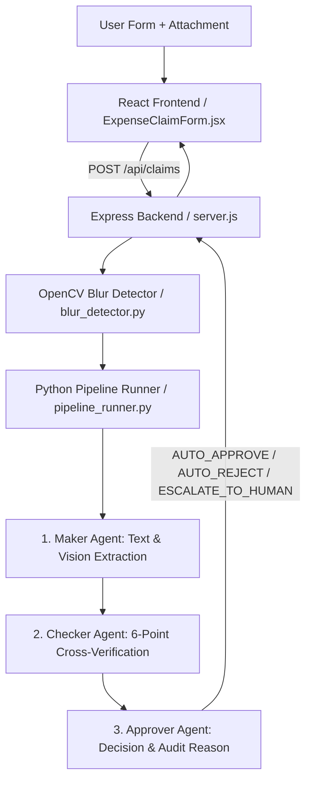

# 🚀 Multi-Agent Expense Claim Assistant

An enterprise-grade, full-stack AI expense reimbursement platform designed for corporate telecom and broadband expense claims. Built with a modern **React 18 + Vite** frontend, **Express.js orchestration backend**, and a **3-Agent Python AI Core** (Maker → Checker → Approver) featuring OpenCV blur preprocessing, digital PDF fast-path extraction, duplicate fraud prevention, and multimodal Vision LLM fallback.

---

## ✨ System Features

### 🖥️ React Frontend (`frontend/`)

- **Formatted INR (₹) Input**: Real-time currency formatting with numeric validation.
- **Smart Category Selection**: Cellphone (Prepaid/Postpaid) vs. Broadband / Fiber.
- **Dynamic Billing Cycle Calculator**: Automatically calculates validity periods (28 Days, 56 Days, 84 Days, 1 Month, 3 Months, 1 Year, etc.).
- **Live 4-Stage Pipeline Visualizer**: Real-time animated stepper (Ingestion → Maker → Checker → Approver) with terminal log stream.
- **Claim Batch Queue**: Queue multiple draft claims with client-side overlap checks before submitting together.
- **Detailed Verification Matrix**: Field-by-field check breakdown, risk score meter, and conditional International Roaming charge display.

### 🤖 Multi-Agent AI Core (`backend/agents/`)

- **1. Maker Agent (`maker_agent.py`)**:
  - **Instant Local Fast-Path (`PyMuPDF / fitz`)**: Parses digital PDF character streams in **< 5ms** with zero network calls and 0% hallucination.
  - **Table-Aware Parser**: Seamlessly connects multiline charges, account numbers, dates, plan codes (`Postpaid_999_3M`, `Airtel-UL-Xstream Value 999`), and speeds (`Unlimited Data @ 150 Mbps`).
  - **Multimodal Vision Fallback (`OpenRouter nemotron-nano-12b-vl`)**: Triggered for scanned receipts, camera photos, or degraded documents.
- **2. Checker Agent (`checker_agent.py`)**:
  - Executes 6 strict validation gates: Document Relevancy, Confidence Threshold (≥ 0.80), Amount Comparison (`Claimed <= Invoice`), Category Alignment, Date Cycle Matching, and Duplicate Fraud Detection.
- **3. Approver Agent (`approver_agent.py`)**:
  - **Auto-Approval (≤ ₹5,000)**: Clean, matching claims up to ₹5,000 are instantly approved.
  - **Direct Auto-Rejections**: Rejects claims with Amount Discrepancies (`Claimed > Invoice`), Policy Cap Breaches (`> ₹5,000`), Duplicate Invoices, or Ineligible Plan Types.
  - **Human Escalation**: Flags Category Mismatches (e.g. Cellphone claimed on Broadband bill) and Blurry/Illegible images with crisp, unique explanations.

### 👁️ OpenCV Image Quality & Blur Detector (`backend/blur_detector.py`)

- Custom 3-metric computer vision ensemble:
  1. **Laplacian Variance** (Bilateral filtered edge gradient sharpness).
  2. **2D FFT High-Frequency Ratio** (Spectral energy distribution).
  3. **Canny Edge Density** (Structural pixel concentration).
- Domain-calibrated scoring (`digital` vs `photo`) to catch blurred or unreadable documents before OCR.

### 🛡️ Duplicate Fraud Prevention (`backend/services/duplicate_service.py`)

- Maintains a persistent duplicate index (`claims_index.json`).
- Prevents double-claiming via Exact Invoice Number Matching and Multivariable Bill Fingerprinting (Same Vendor + Amount + Period).

---

## 🏗️ Architecture Overview



For complete code-by-code technical tracing, see [ARCHITECTURE_REPORT.md](ARCHITECTURE_REPORT.md).

---

## 🚀 Quick Start Guide

### 1. Install All Dependencies

```bash
# From repository root
npm run install:all
```

### 2. Configure Environment Variables

Create a `.env` file in the root directory:

```env
OPENROUTER_API_KEY=your_openrouter_api_key_here
VISION_MODEL=nvidia/nemotron-nano-12b-v2-vl:free
OPENROUTER_BASE_URL=https://openrouter.ai/api/v1
```

### 3. Start the Backend Server

```bash
cd backend
npm run dev
# Server running on http://localhost:5000
```

### 4. Start the React Frontend

```bash
cd frontend
npm run dev
# Frontend running on http://localhost:3000
```

---

## 🧪 Running Automated Tests

Run the complete 24-test unit and scenario test suite:

```bash
cd backend
python3 -m unittest discover -s tests -p "test_*.py" -v
```

### Test Coverage Breakdown

- `tests/test_multi_invoice_scenarios.py`: 8 end-to-end tests covering real Airtel 999, Airtel 3999, and JioFiber 999 document profiles.
- `tests/test_approver_agent.py`: 6 business decision & escalation tests.
- `tests/test_checker_agent.py`: 5 multi-point verification gate tests.
- `tests/test_maker_agent.py`: 5 extraction accuracy & normalization tests.

---

## 📁 Repository Structure

```text
Expense-Claim-Assistant/
├── ARCHITECTURE_REPORT.md               # Complete process & code trace document
├── README.md                            # Project documentation & quick start
├── package.json                         # Root helper scripts
├── .env                                 # OpenRouter & model configuration
│
├── backend/                             # Express + Python AI Core
│   ├── package.json
│   ├── server.js                        # REST API (upload, claim, delete, list)
│   ├── blur_detector.py                 # OpenCV 3-metric blur detection engine
│   ├── pipeline_runner.py               # Multi-agent Python CLI executor
│   ├── run_scenarios.py                 # CLI scenario demonstration script
│   │
│   ├── agents/                          # 3-Agent AI Engine
│   │   ├── maker_agent.py               # Hybrid Text/Vision extractor
│   │   ├── checker_agent.py             # 6-point verification engine
│   │   └── approver_agent.py            # Final decision & audit trail engine
│   │
│   ├── models/                          # Pydantic Schemas & DTOs
│   │   ├── maker_schema.py
│   │   ├── checker_schema.py
│   │   └── approver_schema.py
│   │
│   ├── services/
│   │   └── duplicate_service.py         # Duplicate invoice & fingerprint ledger
│   │
│   ├── data/
│   │   └── claims_index.json            # Persistent claim audit records
│   ├── uploads/                         # Active invoice PDFs and images
│   └── tests/                           # Unit & multi-scenario test suite
│       ├── test_multi_invoice_scenarios.py
│       ├── test_maker_agent.py
│       ├── test_checker_agent.py
│       └── test_approver_agent.py
│
└── frontend/                            # React 18 + Vite Web App
    ├── package.json
    ├── vite.config.js
    └── src/
        ├── App.jsx
        ├── main.jsx
        ├── index.css
        └── components/
            ├── ExpenseClaimForm.jsx     # Main form, visualizer & audit table
            └── ExpenseClaimForm.css     # Premium UI theme & animations
```

---

## 📡 REST API Reference

| Method | Endpoint | Description |
| --- | --- | --- |
| `POST` | `/api/claims` | Submits 1–2 invoice files and runs the full Multi-Agent pipeline |
| `GET` | `/api/claims` | Returns all submitted claims with complete agent audit logs |
| `DELETE` | `/api/claims` | Clears all stored claims, uploads, and duplicate history |
| `DELETE` | `/api/claims/:claimId` | Deletes a single claim record and its disk attachments |
| `GET` | `/api/health` | Health check endpoint |
