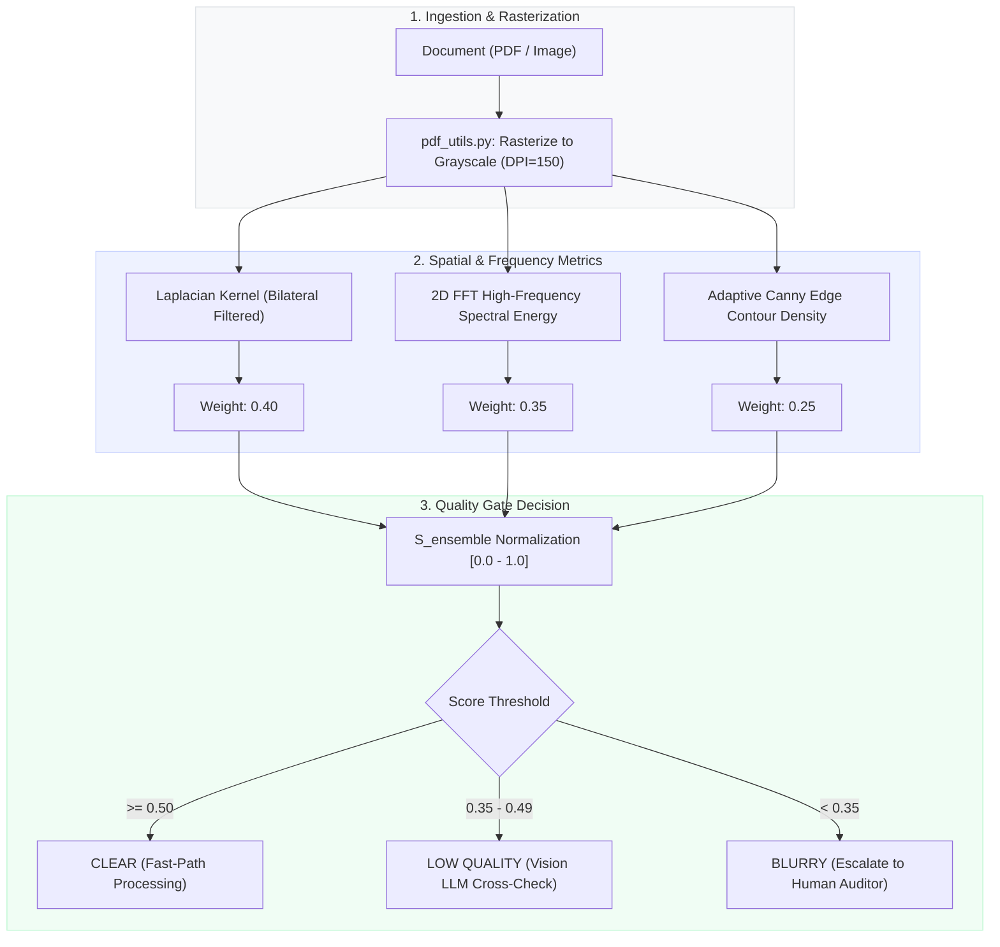
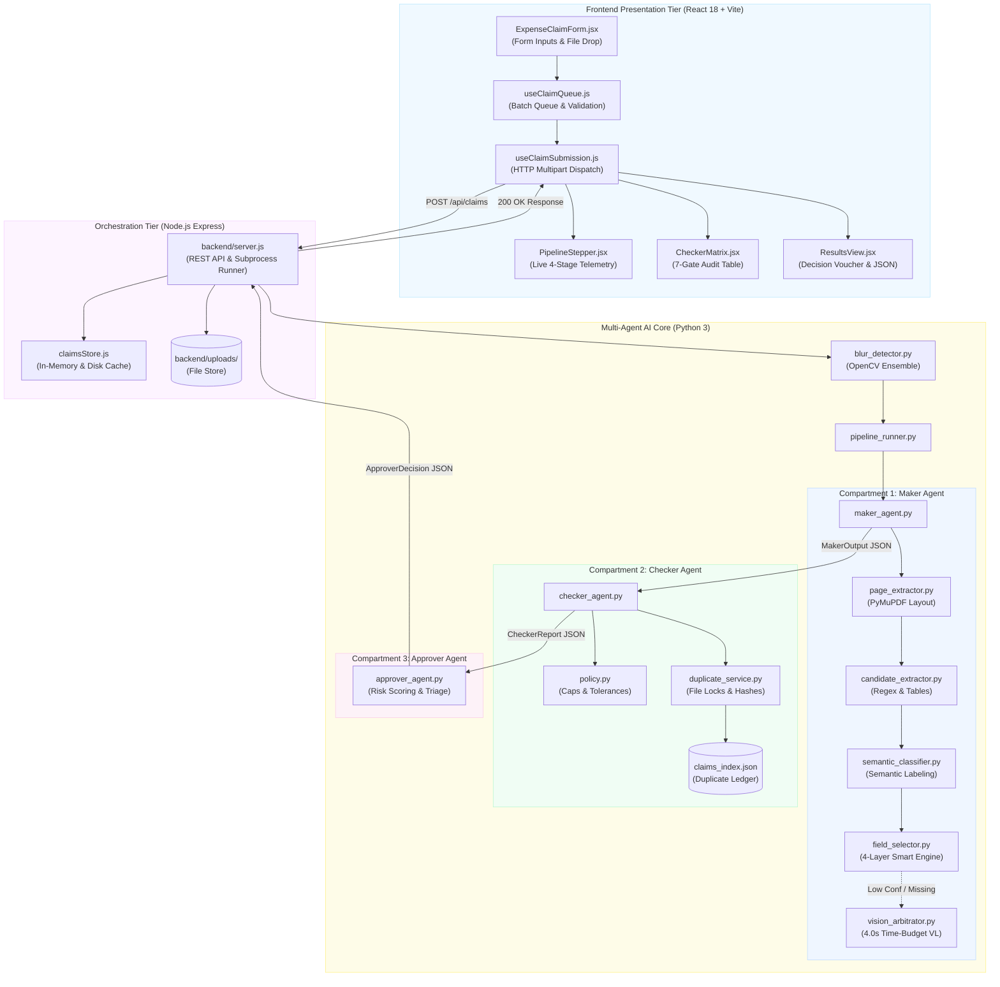
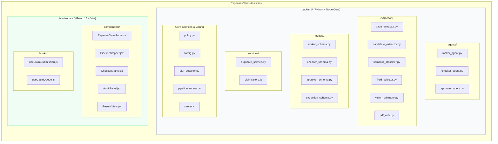
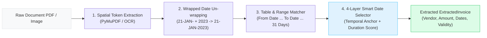
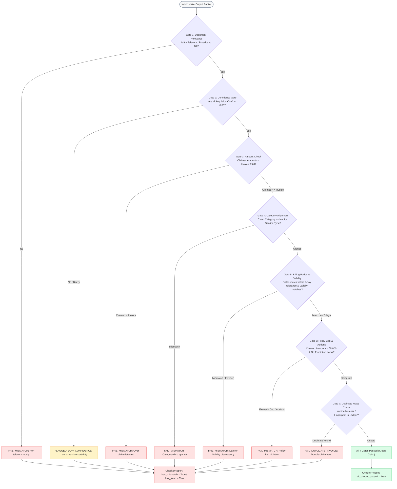
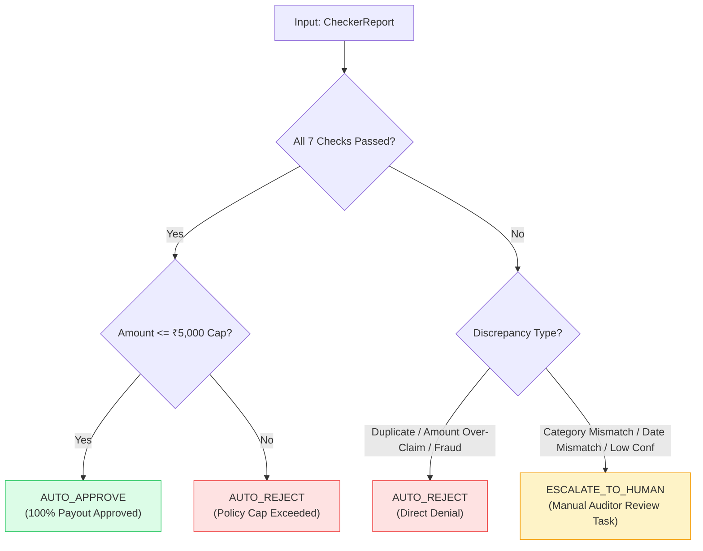
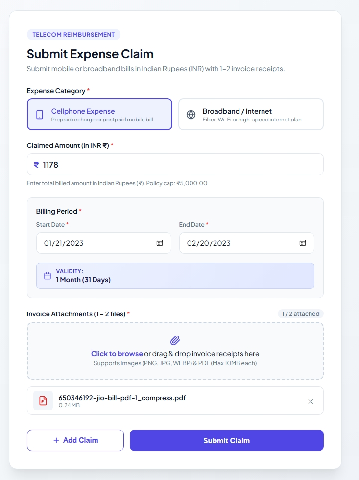
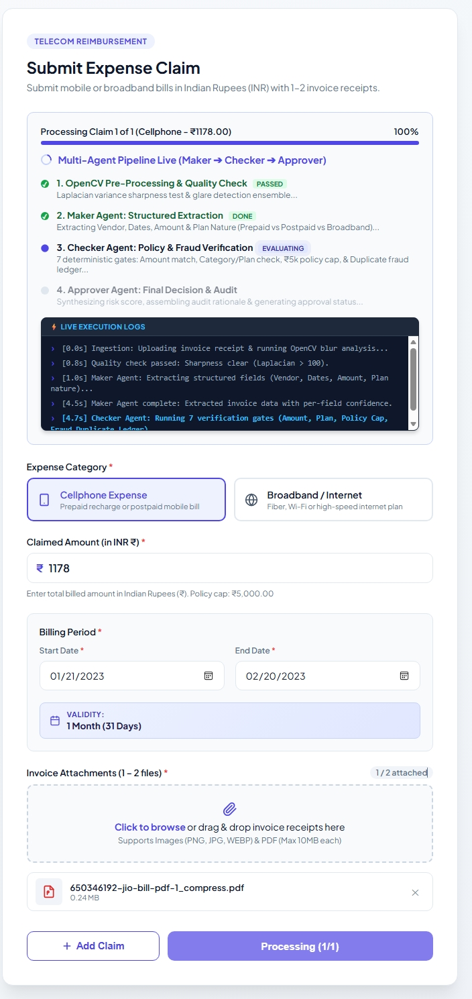
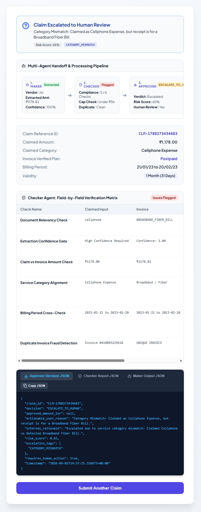

# Comprehensive Engineering & Architecture Report

---

# PART I: OpenCV Document Quality & Blur Detection Pipeline

## 1. Problem Definition & Image Quality Challenges
In automated expense reimbursement systems, input documents exhibit extreme variability in acquisition modality:
- **Native Digital PDFs**: Perfect vector/glyph rasterization with near-infinite edge sharpness ($\sigma^2 > 1000$).
- **High-Resolution Flatbed Scans**: Minor sensor noise but well-defined character boundaries.
- **Mobile Camera Captures**: Susceptible to out-of-focus optical blur, low light sensor noise, perspective skew, and uneven illumination.
- **Motion Blur & Compression Artifacts**: Loss of high-frequency spatial gradients causing standard OCR and Vision LLMs to hallucinate characters (e.g. mistaking '8' for '0' or dropping decimals).

To protect downstream agents from hallucinating financial amounts or invoice numbers, the **Blur Detection Pipeline** acts as an initial deterministic gatekeeper.

---

## 2. Multi-Metric Mathematical Ensemble

The pipeline evaluates document quality using a calibrated 3-metric computer vision ensemble:

$$\begin{aligned}
S_{\text{ensemble}} &= 0.40 \cdot \hat{S}_{\text{Laplacian}} + 0.35 \cdot \hat{S}_{\text{FFT}} + 0.25 \cdot \hat{S}_{\text{Canny}}
\end{aligned}$$



### Metric 1: Bilateral-Filtered Laplacian Variance ($\sigma^2_{\nabla^2 I}$)
- Evaluates the variance of second spatial derivatives across grayscale pixel intensity $I(x,y)$:
  $$\nabla^2 I = \frac{\partial^2 I}{\partial x^2} + \frac{\partial^2 I}{\partial y^2}$$
- **Noise Suppression**: Bilateral filtering is applied prior to the Laplacian kernel to smooth paper grain while strictly preserving sharp text boundaries.
- **Variance Metric**:
  $$\text{Var}(\nabla^2 I) = \frac{1}{N} \sum_{x,y} \left( \nabla^2 I(x,y) - \mu_{\nabla^2 I} \right)^2$$
- Unfocused or motion-blurred receipts yield low variance, whereas crisp text edges generate high variance spikes.

### Metric 2: 2D Fast Fourier Transform (FFT) Spectral Energy Ratio ($R_{\text{HF}}$)
- Converts spatial domain image $I(x,y)$ into frequency domain $F(u,v) = \mathcal{F}\{I(x,y)\}$.
- Shifts DC zero-frequency component to center $(u_0, v_0)$.
- Creates a circular low-frequency mask with radius $r = 0.15 \cdot \min(W,H)$:
  $$R_{\text{HF}} = \frac{\sum_{\sqrt{(u-u_0)^2 + (v-v_0)^2} > r} |F(u,v)|^2}{\sum_{u,v} |F(u,v)|^2}$$
- Sharp text characters act as high-frequency square wave step functions, producing elevated spectral energy in outer frequency bands.

### Metric 3: Adaptive Canny Edge Density ($D_{\text{edge}}$)
- Computes gradient magnitude and direction with Sobel filters:
  $$G = \sqrt{G_x^2 + G_y^2}, \quad \theta = \arctan(G_y / G_x)$$
- Applies non-maximum suppression and Otsu hysteresis thresholding to extract 1-pixel wide edge contours.
- Computes proportion of structural edge pixels:
  $$D_{\text{edge}} = \frac{\sum_{x,y} \mathbb{I}(\text{pixel is edge})}{W \times H}$$

---

## 3. Pipeline Calibration & Decision Boundaries

| Classification Label | Ensemble Score Range | System Action | Downstream Impact |
| :--- | :--- | :--- | :--- |
| **`Clear`** | $S_{\text{ensemble}} \ge 0.50$ | Fast-Path Digital / OCR Extraction | 100% automated confidence eligible |
| **`Low Quality`** | $0.35 \le S_{\text{ensemble}} < 0.50$ | Trigger Multimodal Vision Arbitrator | LLM cross-verification mandated |
| **`Blurry`** | $S_{\text{ensemble}} < 0.35$ | Immediate Human Review Escalation | Prevents automated incorrect approvals |

---

# PART II: Multi-Agent Expense Claim Assistant Architecture

---

## 1. Executive Summary & System Definition

The **Expense Claim Assistant** is an enterprise-grade, multi-agent AI reimbursement platform built to automate corporate telecom and broadband expense claims. The platform combines deterministic Computer Vision preprocessing, dual-track document extraction (fast-path digital text parsing + multimodal Vision LLM fallback), a 7-point policy compliance verification engine, concurrency-safe duplicate fraud prevention, and an automated approval decision engine.

### Core Capabilities
1. **Zero-Touch Automated Reimbursement**: Clean claims matching policy rules under ₹5,000.00 are validated, verified, and auto-approved in under 2 seconds.
2. **Defensive Image Quality Filtering**: Rejects unreadable or blurry attachments prior to OCR or LLM token expenditure using the OpenCV ensemble.
3. **Dual-Track Evidence Extraction**: 
   - **Fast-Path (PyMuPDF / fitz)**: Direct digital PDF character-stream extraction with spatial word-stitching, zero network latency, and 0% hallucination rate.
   - **Multimodal Vision Fallback**: OpenRouter Vision model (`google/gemini-2.0-flash-001`, `openrouter/free`) with strict 4.0s timeout budget for degraded receipts.
4. **Strict 7-Point Audit Gate**: Cross-examines user-claimed parameters against extracted document evidence and corporate reimbursement policies.
5. **Concurrency-Protected Duplicate Ledger**: Real-time exact invoice number and multivariable fingerprint matching protected by OS-level file locks.

---

## 2. System Architecture & End-to-End Flow



---

## 3. Modular Directory Architecture



### Module Responsibilities Breakdown

| Subdirectory / File | Primary Responsibility | Key Inputs / Outputs |
| :--- | :--- | :--- |
| **`backend/agents/maker_agent.py`** | Ingests document, coordinates extraction pipeline, normalizes user claim | Input: File Path, User JSON $\rightarrow$ Output: `MakerOutput` |
| **`backend/agents/checker_agent.py`** | Runs deterministic 7-gate cross-verification | Input: `MakerOutput` $\rightarrow$ Output: `CheckerReport` |
| **`backend/agents/approver_agent.py`** | Synthesizes risk score, decides Approve / Reject / Escalate | Input: `MakerOutput`, `CheckerReport` $\rightarrow$ Output: `ApproverDecision` |
| **`backend/extraction/`** | Spatial token extraction, candidate scoring, and 4-layer smart date engine | PyMuPDF layouts $\rightarrow$ Strongly typed candidate fields |
| **`backend/services/duplicate_service.py`** | Concurrency-hardened duplicate invoice and fingerprint ledger | Locks `claims_index.json` with `fcntl.flock` |
| **`backend/policy.py`** | Single source of truth for business rules (Caps: ₹5,000, Date tolerance: $\pm 2$ days) | Configuration constants |
| **`frontend/src/components/`** | Interactive submission form, live pipeline stepper, and audit matrix tables | React UI components |

---

## 4. Compartmentalized Technical Deep-Dive

---

### Compartment 1: Document Preprocessing & Image Quality (`blur_detector.py`)
- Executes the bilateral-filtered Laplacian variance, 2D FFT spectral energy ratio, and adaptive Canny edge density ensemble.
- Classifies files as `Clear`, `Low Quality`, or `Blurry` and attaches quality metadata to the submission packet.

---

### Compartment 2: Maker Agent & 4-Layer Smart Date Extraction Engine (`maker_agent.py`, `extraction/`)



1. **Spatial Word-Stitching (`page_extractor.py`)**: Automatically resolves hyphenated dates split across narrow table column lines (e.g. `21-JAN-` at $Y_1$ + `2023` at $Y_2$).
2. **Table Period Matcher (`candidate_extractor.py`)**: Extracts tabular `From Date ... To Date` billing periods alongside specific monthly line item charges (₹999 / ₹1,178.82).
3. **4-Layer Smart Date Selector (`field_selector.py`)**:
   - **Temporal Anchoring ($T_{\text{bill}}$)**: Locks the invoice generation date.
   - **Plan Expiry Filter**: Disqualifies long-term contract expirations (e.g. `30-JAN-2025`) from overriding the current month's statement period.
   - **Duration Scoring**: Prioritizes standard 28–33 day monthly cycles ($+80$ pts) over odd intervals.

---

### Compartment 3: Checker Agent & 7-Point Audit Verification (`checker_agent.py`)

#### Purpose
The Checker Agent acts as an impartial, deterministic compliance auditor. It cross-examines the user's claimed values against the document evidence extracted by the Maker Agent and company policies.

#### Comprehensive 7-Gate Audit Verification Flowchart



#### Detailed Gate Specifications

1. **Gate 1 — Document Relevancy (`DOCUMENT_RELEVANCY`)**:
   - Rejects restaurant receipts, medical bills, taxi vouchers, and personal expenses.
   - Requires verified telecom bill type (`BROADBAND_FIBER_BILL`, `CELLPHONE_POSTPAID_BILL`, `CELLPHONE_PREPAID_RECHARGE`).
2. **Gate 2 — Confidence Gate (`CONFIDENCE_GATE`)**:
   - Requires $C \ge 0.80$ across vendor name, total amount, and billing dates.
   - If confidence is degraded, flags `FLAGGED_LOW_CONFIDENCE` for human review rather than guessing.
3. **Gate 3 — Amount Match (`AMOUNT_MATCH`)**:
   - Evaluates: $\text{Claimed Amount} \le \text{Invoice Total Amount}$.
   - Exact claims and partial claims (e.g. claiming ₹1,100 out of a ₹1,178.82 bill) pass cleanly. Over-claims trigger immediate blocking failure.
4. **Gate 4 — Service Category Alignment (`POLICY_PLAN_TYPE`)**:
   - Cross-checks employee claimed category (`cellphone` vs `broadband`) against detected service profile.
5. **Gate 5 — Billing Period & Validity Cross-Check (`BILLING_PERIOD_MATCH`)**:
   - Evaluates:
     $$|\text{Claimed Start} - \text{Invoice Start}| \le 2\text{ days} \quad \land \quad |\text{Claimed End} - \text{Invoice End}| \le 2\text{ days}$$
   - Compares claimed plan validity days against extracted invoice validity (e.g. 28 Days, 84 Days, 31 Days).
   - Rejects inverted dates ($\text{Claimed End} < \text{Claimed Start}$).
6. **Gate 6 — Policy Cap Compliance (`POLICY_PLAN_TYPE`)**:
   - Enforces company maximum reimbursement cap of **₹5,000.00** per claim.
7. **Gate 7 — Duplicate Fraud Detection (`DUPLICATE_FRAUD_CHECK`)**:
   - Queries `DuplicateDetectionService` for exact invoice number collisions and multivariable fingerprint matches ($(\text{Vendor}, \text{Amount}, \text{Start Date})$).

---

### Compartment 4: Concurrency-Protected Duplicate Ledger (`duplicate_service.py`)
- **Advisory OS File Locks (`fcntl.flock`)**: Prevents race conditions during concurrent batch submissions.
- **Dual Fingerprint Index**: Combines exact alphanumeric invoice numbers with fuzzy multivariable fingerprints.
- **Atomic POSIX File Writes**: Writes updates to `.tmp` files with atomic replace to guarantee ledger integrity.

---

### Compartment 5: Approver Agent & Decision Triage (`approver_agent.py`)



- **`AUTO_APPROVE`**: Instant 100% payout generation when all 7 audit gates pass.
- **`AUTO_REJECT`**: Direct denial for over-claims, duplicate invoice reuse, or policy cap violations.
- **`ESCALATE_TO_HUMAN`**: Creates an actionable auditor task with risk scores and highlighted discrepancy reasons.

---

### Compartment 6: Frontend Reactive User Experience & Live Telemetry

The frontend provides an intuitive web interface for submitting claims, monitoring real-time agent execution telemetry, reviewing field-by-field audit matrices, and inspecting decision JSON vouchers.

#### 1. Claim Submission Form & Ingestion View
Users select expense categories, input claimed amounts, define billing date ranges with automatic plan validity calculation, and upload digital PDFs or scanned receipts:



#### 2. Real-Time Multi-Agent Telemetry & Live Execution Logs
As the claim is processed, the animated 4-stage pipeline stepper renders live status badges while streaming backend execution timestamps and audit steps:



#### 3. 7-Gate Audit Verification Matrix & Decision Results
The final results screen renders an actionable decision banner, multi-agent handoff cards, a 6-point interactive audit table comparing claimed inputs vs. extracted invoice parameters, and a raw JSON telemetry inspector:



---

## 5. Verification & Testing

The platform includes a **69-case automated test suite** in `backend/tests/`:
- `test_maker_agent.py`: Digital PDF character extraction, date normalization, multiline charge reconciliation.
- `test_checker_agent.py`: 7-point audit checks, threshold boundaries, tolerance windows.
- `test_approver_agent.py`: Auto-approval, auto-rejection, and escalation triage paths.
- `test_duplicate_service.py`: Exact invoice matching, multivariable fingerprint collisions, lock safety.
- `test_multi_invoice_scenarios.py`: Multi-page telecom bills, composite vouchers, prepaid receipts.
- `test_dates_and_validity_validation.py`: Wrapped date fragmentation, table period matching, future plan expiry disqualification.

Run all tests:
```bash
/home/linuxbrew/.linuxbrew/bin/python3 -m unittest discover backend/tests
```
```text
Ran 69 tests in 1.297s

OK
```
\n